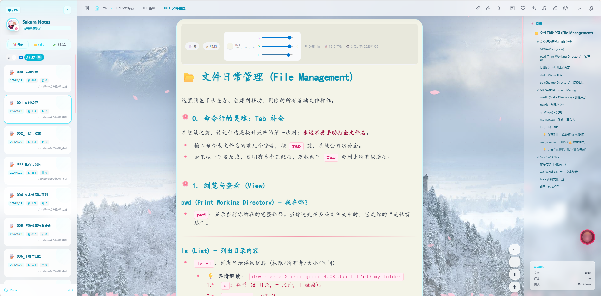

# 🌸 Sakura Notes

<div align="center">

[](https://soft-zihan.github.io/SakuraBlog/)
[](LICENSE)
[](https://vuejs.org/)
[](https://vitejs.dev/)
[![zread](https://img.shields.io/badge/Ask_Zread-_.svg?style=flat&color=00b0aa&labelColor=000000&logo=data%3Aimage%2Fsvg%2Bxml%3Bbase64%2CPHN2ZyB3aWR0aD0iMTYiIGhlaWdodD0iMTYiIHZpZXdCb3g9IjAgMCAxNiAxNiIgZmlsbD0ibm9uZSIgeG1sbnM9Imh0dHA6Ly93d3cudzMub3JnLzIwMDAvc3ZnIj4KPHBhdGggZD0iTTQuOTYxNTYgMS42MDAxSDIuMjQxNTZDMS44ODgxIDEuNjAwMSAxLjYwMTU2IDEuODg2NjQgMS42MDE1NiAyLjI0MDFWNC45NjAxQzEuNjAxNTYgNS4zMTM1NiAxLjg4ODEgNS42MDAxIDIuMjQxNTYgNS42MDAxSDQuOTYxNTZDNS4zMTUwMiA1LjYwMDEgNS42MDE1NiA1LjMxMzU2IDUuNjAxNTYgNC45NjAxVjIuMjQwMUM1LjYwMTU2IDEuODg2NjQgNS4zMTUwMiAxLjYwMDEgNC45NjE1NiAxLjYwMDFaIiBmaWxsPSIjZmZmIi8%2BCjxwYXRoIGQ9Ik00Ljk2MTU2IDEwLjM5OTlIMi4yNDE1NkMxLjg4ODEgMTAuMzk5OSAxLjYwMTU2IDEwLjY4NjQgMS42MDE1NiAxMS4wMzk5VjEzLjc1OTlDMS42MDE1NiAxNC4xMTM0IDEuODg4MSAxNC4zOTk5IDIuMjQxNTYgMTQuMzk5OUg0Ljk2MTU2QzUuMzE1MDIgMTQuMzk5OSA1LjYwMTU2IDE0LjExMzQgNS42MDE1NiAxMy43NTk5VjExLjAzOTlDNS42MDE1NiAxMC42ODY0IDUuMzE1MDIgMTAuMzk5OSA0Ljk2MTU2IDEwLjM5OTlaIiBmaWxsPSIjZmZmIi8%2BCjxwYXRoIGQ9Ik0xMy43NTg0IDEuNjAwMUgxMS4wMzg0QzEwLjY4NSAxLjYwMDEgMTAuMzk4NCAxLjg4NjY0IDEwLjM5ODQgMi4yNDAxVjQuOTYwMUMxMC4zOTg0IDUuMzEzNTYgMTAuNjg1IDUuNjAwMSAxMS4wMzg0IDUuNjAwMUgxMy43NTg0QzE0LjExMTkgNS42MDAxIDE0LjM5ODQgNS4zMTM1NiAxNC4zOTk4IDQuOTYwMVYyLjI0MDFDMTQuMzk4NCAxLjg4NjY0IDE0LjExMTkgMS42MDAxIDEzLjc1ODQgMS42MDAxWiIgZmlsbD0iI2ZmZiIvPgo8cGF0aCBkPSJNNCAxMkwxMiA0TDQgMTJaIiBmaWxsPSIjZmZmIi8%2BCjxwYXRoIGQ9Ik00IDEyTDEyIDQiIHN0cm9rZT0iI2ZmZiIgc3Ryb2tlLXdpZHRoPSIxLjUiIHN0cm9rZS1saW5lY2FwPSJyb3VuZCIvPgo8L3N2Zz4K&logoColor=ffffff)](https://zread.ai/soft-zihan/SakuraBlog)
[](https://deepwiki.com/soft-zihan/SakuraBlog)

<br/>

<div align="center">
  <h3>🌸 Sakura Notes (Sakura Blog)</h3>
  <p><b>Backend-free, SSG-free</b> Vue knowledge base & static blog, designed for GitHub Pages.</p>
  <p>
    <b>What makes it different</b><br/>
    • Build-time generates the notes index, rendered HTML, and raw sources<br/>
    • Browser publishing via GitHub API (smart Fork + PR fallback)<br/>
    • Runtime theming (CSS variables + Tailwind) with system/time-based dark mode<br/>
    • Learning Lab: an 8-stage roadmap plus an annotated Source Viewer
  </p>
  <p>
    <a href="https://soft-zihan.github.io/SakuraBlog/">🌐 Live Demo</a> · 
    <a href="README_zh.md">📖 中文</a> · 
    <a href="https://github.com/soft-zihan/SakuraBlog/issues">🐛 Report Issues</a>
  </p>
</div>

</div>



---
## 📑 Table of Contents

- [✨ Features Overview](#-features-overview)
- [🧠 How Backend-free Works](#-how-backend-free-works)
- [🙏 Credits](#-credits)
- [🎯 Quick Start](#-quick-start)
- [🧪 Testing](#-testing)
- [⚡ First-Load Performance (No Cache)](#-first-load-performance-no-cache)
- [📁 Project Structure](#-project-structure)
- [🏗️ Technical Architecture](#️-technical-architecture)
- [🔧 Configuration Guide](#-configuration-guide)
- [ Security &amp; Data](#-security--data)
- [🤝 Contribution Guide](#-contribution-guide)
- [📜 Changelog](#-changelog)
- [🔬 Implementation Deep Dive](#-implementation-deep-dive)
- [🧩 Trade-offs for Static Deployment](#-trade-offs-for-static-deployment)
- [🚀 Migrating to a Full-Stack App (No Fork+PR Dependency)](#-migrating-to-a-full-stack-app-no-forkpr-dependency)

---

## ✨ Features Overview

### 🧩 Backend-free by Design (Static Hosting First)

| Feature | Description |
| :-- | :-- |
| **Build-time data pipeline** | Generates `public/data/files.json`, pre-rendered HTML, raw source copies, and media manifests before deployment. |
| **Runtime = static fetch** | Notes and generated artifacts are loaded via `fetch()` from static hosting (GitHub Pages friendly). |
| **Local-first state** | Preferences, reading actions, and Lab progress persist in the browser (`localStorage` + Pinia). |
| **Optional integrations** | Comments (Giscus), reading stats (Umami Share Token API), and cloud backup (GitHub) without running your own backend. |

### ✍️ Publishing Without a Server (GitHub-native)

| Feature | Description |
| :-- | :-- |
| **Publishing workbench** | Import/preview files, rename, choose folder, inject tags/author metadata, and publish from the browser. |
| **Real-time preview** | Live Markdown preview while editing. |
| **Auto image upload** | Local images referenced in Markdown can be uploaded to GitHub automatically. |
| **Smart Fork + PR** | Contributors without write access can fork and open a PR automatically (upstream stays protected). |

### 🎨 Theme System (Runtime Skins, Not Just Dark Mode)

| Feature | Description |
| :-- | :-- |
| **Runtime palette switching** | Theme colors are CSS variables, consumed by Tailwind for a real “change-the-whole-skin” experience. |
| **Dark mode strategies** | Manual toggle, follow system, or auto-switch by time schedule. |
| **Wallpaper & ambience** | Wallpaper layers + music player; visual ambience is part of the reading experience. |
| **Sakura interaction layer** | Draggable petals and long-press vortex interaction, designed not to block page clicks. |

### 📱 Mobile Polish

| Feature | Description |
| :-- | :-- |
| **Touch-native interactions** | Uses pointer events for both mouse and touch; drag interactions disable default touch actions when needed. |
| **Effects that don’t block reading** | Background effects default to non-interactive layers; only petals are pointer-enabled. |
| **Mobile-safe links & assets** | Resolves internal links/images/PDF embeds with a GitHub Pages-friendly base URL strategy. |
| **Modal & reader ergonomics** | Search and panels use viewport-based heights and responsive layout to stay usable on small screens. |

### 🧪 Learning Lab & Source Viewer

| Feature | Description |
| :-- | :-- |
| **8-stage roadmap** | A staged learning path (from Web basics to Vue 3 advanced and a final challenge). |
| **Progress persistence** | Tracks completion and recommends what to learn next, stored locally. |
| **Annotated source viewer** | Read real project files with preset notes and your own per-line notes. |
| **Productive reading tools** | Folding for functions/classes/Vue SFC blocks, plus import/export and GitHub submission for notes. |

### 📚 Core Reading Experience

| Feature | Description |
| :-- | :-- |
| **Markdown + ToC + highlighting** | Markdown rendering with automatic ToC and syntax highlighting. |
| **Full-text search** | MiniSearch-based search with mixed CN/EN tokenization, incremental indexing, and cached index. |
| **Reader utilities** | Favorites, likes, tag filtering, and reading history. |
| **PDF friendly** | PDF links can be embedded for in-page reading and open/download actions. |

### 🔐 Security & Data (Best-effort on the Client)

| Feature | Description |
| :-- | :-- |
| **Encrypted token storage** | AES-256-GCM with PBKDF2-derived device-bound key; tokens are never stored in plaintext. |
| **Backup exclusion** | Tokens are explicitly excluded from all backup flows. |
| **Local & cloud backups** | Backup/restore preferences and progress locally, or to GitHub (optional). |

---

## 🧠 How Backend-free Works

Sakura Notes runs as a static app by moving “dynamic needs” to build time and keeping user data local.

```text
notes/ (Markdown knowledge base)
  │
  ├─ build prep (scripts/*)
  │    ├─ scan notes → public/data/files.json
  │    ├─ copy notes → public/notes/**
  │    ├─ pre-render → public/rendered/** (HTML + ToC)
  │    └─ export source → public/raw/** (for Source Viewer)
  │
  └─ vite build → dist/
           │
           ▼
GitHub Pages (static hosting)
           │
           ▼
Browser runtime
  ├─ fetch() static assets (notes/index/rendered/raw)
  ├─ persist state in localStorage (preferences/progress)
  └─ write operations (optional): GitHub API (token) + Fork+PR fallback
```

## 🙏 Credits

- Comments and reading stats implementation is inspired by [RyuChan](https://github.com/kobaridev/RyuChan).

## 🎯 Quick Start

### Option 1: Fork & Deploy (Recommended)

1. **Fork the Repository**
   - Click the `Fork` button in the top right corner.
2. **Enable GitHub Pages**
   - Go to `Settings` → `Pages`.
   - Set "Source" to `GitHub Actions`.
3. **Add Content**
   - Create `.md` files in `notes/zh/` or `notes/en/`.
   - Push your code; GitHub Actions will automatically build and deploy.
4. **Access Your Site**
   - `https://<your-username>.github.io/<repo-name>/`

### Option 2: Local Development

```bash
# Clone the repository
git clone https://github.com/soft-zihan/SakuraBlog.git
cd SakuraBlog

# Install dependencies
npm install

# Start development server
npm run dev

# Build for production
npm run build
```

### Option 3: Online Publishing

Visit [Sakura Notes](https://soft-zihan.github.io/SakuraBlog/) directly and click the Settings icon:

1. Enter your GitHub Token (requires `repo` scope).
2. Configure your target repository info.
3. Use the "Write" workbench to compose and publish; the system will automatically fork to your account.
4. A Pull Request will be created for you automatically.

---

## 🧪 Testing

```bash
npm run test -- --run
```

---

## ⚡ First-Load Performance (No Cache)

This project targets static hosting (e.g. GitHub Pages), where **first-time visitors have zero cache** and every byte matters. The optimization goal is: **show a complete app shell fast**, then **progressively fill content**, while **pre-warming heavy modules in idle time** so users rarely feel “lazy-load delays”.

### Boot Pipeline (What happens on first open)

1. **Stage 0 — HTML boot screen**: `src/index.html` renders an immediate placeholder and runs a tiny boot script:
   - Shows a staged loading message (download core → init UI → load index).
   - Fails fast with a helpful UI (no more infinite spinner) if the entry script fails or if boot takes too long.
   - Provides “Lite Mode” (`localStorage: sakura:liteMode:v1`) for slow devices/networks.
2. **Stage 1 — Vue mount**: `src/main.ts` mounts the app as soon as the entry bundle executes.
3. **Stage 2 — Index first, content later**: `src/composables/useAppInit.ts` loads `public/data/files.json`:
   - Sidebar/tree/list can appear first.
   - Article content can load afterwards (with an in-app loading overlay).
4. **Stage 3 — Opportunistic warm-up**: `src/App.vue` uses idle time to progressively `import()` heavier modules (search/markdown/lab/write/download, etc.), so users usually don’t notice module loading.

### Key Strategies

- **Remove critical-path blockers**: avoid extra synchronous/defer scripts before the entry module; keep the boot path minimal.
- **Async split, but not “wait until clicked”**: make heavy features loadable as chunks, then preload them during idle windows (“see gaps, fill gaps”).
- **Parallelize index download**: the boot script can prefetch `./data/files.json` early, and the app init reuses it when available.
- **Lite Mode escape hatch**: if boot is slow, users can switch to a reduced-effects mode that prioritizes readability and responsiveness.

### Troubleshooting “stuck on Loading…”

If you keep seeing the HTML boot screen, Vue likely never mounted:

- **Wrong publish directory**: GitHub Pages should serve `dist/` (not `src/`).
- **Entry bundle 404**: check DevTools → Network for `assets/index-*.js`.
- **Sub-path deployment mismatch**: ensure the entry script path works under `/<repo>/` on GitHub Pages.
- **Runtime error before mount**: check Console for an exception during module initialization.

## 📁 Project Structure

```
sakura-notes/
├── 📁 scripts/              # Build prep scripts (generate data into public/)
│   ├── generate-tree.ts
│   ├── generate-raw.ts
│   ├── generate-music.ts
│   └── generate-wallpapers.ts
├── 📁 src/                  # Source code
│   ├── 📄 main.ts           # Vue app mount entry
│   ├── 📄 App.vue           # Root component (Layout & State)
│   ├── 📄 index.html        # HTML entry
│   ├── 📄 constants.ts      # i18n constants
│   ├── 📄 types.ts          # Global type definitions
│   │
│   ├── 📁 views/            # Page Views
│   │   └── ArticleReader.vue # Dedicated Article Reader & TOC
│   │
│   ├── 📁 layout/           # Layout shells
│   │   └── AppLayout.vue
│   │
│   ├── 📁 components/       # Vue components
│   │   ├── AppHeader.vue      # Top navigation bar
│   │   ├── ArticleInfoBar.vue  # Article info / actions bar
│   │   ├── ArticleToc.vue      # Article table of contents (TOC)
│   │   ├── ThemePanel.vue     # Theme settings panel
│   │   ├── AppSidebar.vue     # Sidebar navigation
│   │   ├── SidebarFilterPanel.vue # Sidebar filters
│   │   ├── MainContent.vue    # Main content area
│   │   ├── 📁 Modals/         # Modal components
│   │   │   ├── CodeModal.vue
│   │   │   └── Lightbox.vue
│   │   └── 📁 lab/            # Learning Lab system
│   │       ├── LabDashboard.vue
│   │       ├── SourceCodeViewer.vue
│   │       ├── 📁 stage1-foundation/ ... 📁 stage8-challenge/
│   │       └── 📁 stages/        # Lab stage wrapper pages
│   │           └── StageLearningGuide.vue
│   │
│   ├── 📁 composables/      # Vue 3 Composables (Logic Reuse)
│   │   ├── useArticleMeta.ts  # Metadata extraction
│   │   ├── useContentRenderer.ts # Markdown rendering
│   │   ├── useFile.ts         # File operations
│   │   ├── useUmamiViewStats.ts # Umami Share Token stats
│   │   └── ...
│   │
│   └── 📁 stores/           # Pinia state management
│       ├── appStore.ts        # Global app settings
│       ├── articleStore.ts    # Article interactions
│       ├── articleNavStore.ts # Article TOC & navigation
│       ├── learningStore.ts   # Learning progress
│       └── musicStore.ts      # Music player state
│
│   ├── 📁 locales/          # i18n locales
│   │   ├── en.ts
│   │   └── zh.ts
│   │
│   ├── 📁 styles/           # Global styles
│   │   └── app.css
│   │
│   ├── 📁 utils/            # Utility functions
│   │   ├── fileUtils.ts
│   │   ├── i18nText.ts
│   │   ├── sanitize.ts
│   │   ├── storage.ts
│   │   └── wallhavenApi.ts
│
├── 📁 public/              # Static assets (generated data)
│   ├── 📁 data/
│   │   ├── files.json
│   │   ├── music.json
│   │   ├── wallpapers.json
│   │   ├── 📁 source-notes-preset/  # Per-file notes preset (Source Viewer)
│   │   │   ├── 📁 zh/
│   │   │   └── 📁 en/
│   │   ├── source-notes-preset.zh.json
│   │   └── source-notes-preset.en.json
│   ├── 📁 raw/              # Generated raw source files for Source Viewer
│   └── 📁 notes/
│
├── 📄 vite.config.ts      # Vite build configuration
└── 📄 tsconfig.json       # TypeScript configuration
```

---

## 🏗️ Technical Architecture

### Core Tech Stack

| Tech                   | Version | Purpose                              |
| :--------------------- | :------ | :----------------------------------- |
| **Vue 3**        | 3.5     | Frontend framework (Composition API) |
| **TypeScript**   | 5.4     | Type safety                          |
| **Vite**         | 4.4     | Build tool                           |
| **Pinia**        | 3.0     | State management                     |
| **Tailwind CSS** | 3.x     | Utility-first CSS                    |
| **Highlight.js** | 11.9    | Code syntax highlighting             |
| **MiniSearch**   | 7.1     | Full-text search engine              |
| **Marked**       | 12.0    | Markdown parsing                     |

### Build Workflow

```bash
npm run build
# This triggers:
# 1. scripts/generate-tree.ts         → Mirrors notes/, generates files.json, and exports source files into /public/raw
# 2. scripts/generate-raw.ts          → Legacy raw exporter (kept for compatibility; generate-tree already exports raw files)
# 3. scripts/generate-music.ts        → Scans public/music/ for music.json
# 4. scripts/generate-wallpapers.ts   → Scans wallpapers to create wallpapers.json
# 5. vite build                       → Bundles the Vue application
```

---

## 🔧 Configuration Guide

### GitHub Token Configuration

The publishing feature requires a Personal Access Token:

1. Go to [GitHub Settings → Developer settings → Personal access tokens](https://github.com/settings/tokens).
2. Create a token with the `repo` scope.
3. Enter the token in the site's Settings panel.

> ⚠️ The token is stored using AES-256-GCM encryption with a key derived from your browser fingerprint.

### Giscus Comments

1. Enable [GitHub Discussions](https://docs.github.com/en/discussions) in your repo.
2. Install the [Giscus App](https://github.com/apps/giscus).
3. Get your configuration parameters from [giscus.app](https://giscus.app/).
4. Update the configuration in `components/GiscusComments.vue`.

### Reading Stats (Umami Cloud, optional)

Inspired by RyuChan, Sakura Notes uses Umami as the source of truth: the tracker records pageviews, and the UI reads stats via the Share Token API. Since this project uses static hosting + query navigation, each article is mapped to a virtual path `/notes/<filePath>` for per-article stats.

1. Create a website in Umami Cloud.
2. Copy the `websiteId` from the tracking script snippet in Umami.
3. Enable sharing for that website, then copy the `shareId` from the Share URL (the last path segment).
4. Create `.env` (or `.env.local`) and set:

   ```bash
   VITE_UMAMI_SCRIPT_URL=https://cloud.umami.is/script.js
   VITE_UMAMI_WEBSITE_ID=<your-website-id>
   VITE_UMAMI_BASE_URL=https://cloud.umami.is
   VITE_UMAMI_SHARE_ID=<your-share-id>
   VITE_UMAMI_TIMEZONE=Asia/Shanghai
   ```

5. Rebuild and deploy.

### Media Proxy (Bilibili & Downloads, optional)

When deployed as a fully static site (GitHub Pages), some media sources cannot be fetched or downloaded directly due to CORS and anti-leech policies. Sakura Notes supports an optional Cloudflare Worker proxy for:

- **Bilibili search/playback** via signed WBI endpoints
- **Reliable downloads** (music cover images, wallpapers) via `Content-Disposition: attachment`

1. Deploy the Worker in `bili-proxy-worker/`.
2. Create `.env` (or `.env.local`) and set:

   ```bash
   # Required for Bilibili search/playback
   VITE_BILI_PROXY_BASE_URL=https://<your-worker>.workers.dev

   # Optional: download proxy for wallpapers/covers (defaults to VITE_BILI_PROXY_BASE_URL if unset)
   VITE_WALLPAPER_PROXY_BASE_URL=https://<your-worker>.workers.dev
   ```

3. Rebuild and deploy.

**Notes**

- Bilibili search results support **click-to-play** and **infinite scroll pagination** in the UI.
- Music downloads will download **audio + cover** (as a separate image file) when a cover URL exists.
- The Worker exposes download-friendly routes like `GET /api/wallpaper/file?url=...&filename=...`.

---

## 🔐 Security & Data

### Token Security Strategy

- **AES-256-GCM**: Industry-standard symmetric encryption.
- **Device-bound Key**: The key is derived from browser/device traits (userAgent, screen, timezone, language, etc.) plus a per-token salt.
- **Backup Exclusion**: Tokens are strictly excluded from all backup operations.
- **Direct API Use**: Tokens are only sent to the GitHub API, never to any third-party servers.

### localStorage Content

| Data Type    | Key Prefix                 | Description                       |
| :----------- | :------------------------- | :-------------------------------- |
| Preferences  | `app-store`              | Themes, fonts, wallpaper settings |
| Interactions | `article-store`          | Favorites, likes                  |
| Repo Config  | `github_*`               | Repository info, author name      |
| Backups      | `backup_*`               | Backup data (import/export)       |
| Token        | `github_pat_*`           | Encrypted token materials (excluded from backups) |

> ⚠️ **Warning**: Clearing browser data will delete these settings. Please use the backup feature regularly!

---

## 🤝 Contribution Guide

### Contributing Content (Notes/Articles)

**Method 1: Web Interface**

1. Visit the live site and configure your Token.
2. Use the Workbench to write and publish.
3. The system will create a PR for you automatically.

**Method 2: Direct PR**

1. Fork the repo.
2. Add `.md` files to the `notes/` directory.
3. Submit a PR to the `main` branch.

### Commit Conventions

- `feat`: New feature
- `fix`: Bug fix
- `docs`: Documentation update
- `refactor`: Code refactoring
- `chore`: Build/tool changes

---

## 📜 Changelog

### v1.1

- 🐛 Fixed 404 error for non-owner submissions.
- 🔧 Optimized permission checks (Smart Fork + PR logic).
- 🔐 Added AES-256-GCM encryption for Tokens.
- 💾 Added local backup system (Import/Export).
- 👁️ Added real-time preview to the Publishing Workbench.
- 🧪 Completed 8-stage Learning Lab path.
- 🌸 Added draggable Sakura petal system.
- 🔍 Integrated full-text search.

### v1.0

- 🎉 Initial release.
- 📝 Basic Markdown note system.
- 🌐 Multi-language support.
- 📱 Responsive design.

---

## 🔬 Implementation Deep Dive

This section explains the critical paths that make the project work as a fully static site: what gets generated at build time, what is loaded at runtime, and why the design is structured this way.

### 1) Notes tree index: from `notes/` to runtime-consumable data

- **Goal**: Let the frontend quickly know what files/folders exist and their metadata, without a backend.
- **How**: A build-prep script scans `notes/`, generates an index JSON, and mirrors Markdown files into `public/notes/` so the browser can `fetch()` them.
- **Key script**: `scripts/generate-tree.ts`
- **Outputs**: `public/data/files.json`, `public/notes/**`

### 2) Source viewer: reading project source code inside the site

- **Goal**: Display this project’s own Vue components / utilities as readable source code in the Learning Lab, with “preset notes” that guide the reader.
- **How**:
  - A build-prep script generates a “Project Source Code” tree and exports source files into `public/raw/` (so production doesn’t need direct access to `src/`).
  - The frontend loads these raw text files and overlays preset notes (and user notes) for navigation and explanations.
- **Key script**: `scripts/generate-tree.ts`
- **Key component**: `src/components/lab/SourceCodeViewer.vue`
- **Preset notes data**: `public/data/source-notes-preset.zh.json` and `public/data/source-notes-preset.en.json` (optional `match/matchRegex` anchors reduce drift when code changes)
- **Note**: `src/utils/i18nText.ts` is not the UI i18n dictionary (that lives in `src/locales/*`). It only helps anchoring preset notes to code lines.

### 3) Markdown rendering: ToC, code highlighting, and safety

- **Goal**: Render Markdown client-side with a Table of Contents, syntax highlighting, and safe HTML.
- **How**: Parse Markdown into HTML, generate ToC, and sanitize output to reduce injection risks.
- **Relevant modules**: `src/composables/useContentRenderer.ts`, `src/utils/sanitize.ts`

### 4) Full-text search: why indexing matters

- **Goal**: Provide fast in-browser search with hit highlighting, without server-side search.
- **How**: Use MiniSearch on the client, combined with metadata and loading strategies to keep initial load reasonable.
- **Relevant modules**: `src/composables/useSearch.ts`, `src/stores/articleStore.ts`

### 5) Publishing workbench: “write + upload + publish” in a static world

- **Goal**: Publish notes directly from the browser, including image uploads, without running your own backend.
- **How**: Use GitHub APIs for write operations; for users without write access, fall back to Fork + PR so contributions still work.
- **Relevant module**: `src/composables/useGitHubPublish.ts`

### 6) Token security and backups: best-effort protection in the browser

- **Goal**: Avoid storing GitHub Tokens in plaintext and never include them in backups.
- **How**: AES-256-GCM encryption with keys derived from a browser fingerprint; backup flow explicitly excludes tokens.
- **Relevant modules**: `src/composables/useTokenSecurity.ts`, `src/composables/useBackup.ts`

---

## 🧩 Trade-offs for Static Deployment

To run on GitHub Pages (or any static hosting) with no backend, the project makes these trade-offs:

- **Make runtime data a build artifact**: notes index, raw source copies, music/wallpaper lists are generated into `public/` during build time.
- **Outsource write operations to third-party APIs**: publishing/image uploads/cloud backup rely on GitHub APIs (authorized by a token).
- **Use PR as a collaboration boundary**: when a user lacks write access, Fork + PR enables contribution while protecting the upstream repo.
- **Key limitations**:
  - Tokens exist in the browser; encryption helps, but it is not the same security posture as a server-side secret.
  - GitHub APIs have rate limits and permission boundaries; PR-based publishing is not instantly live (merge required).
  - Upload size/latency/availability are bounded by the GitHub ecosystem.

---


## 📄 License

[MIT License](LICENSE) © 2024-present

---

<div align="center">

**🌸 May this project become your little garden for organizing knowledge and sharing your life 🌸**

Made with ❤️ by [soft-zihan](https://github.com/soft-zihan)

</div>
