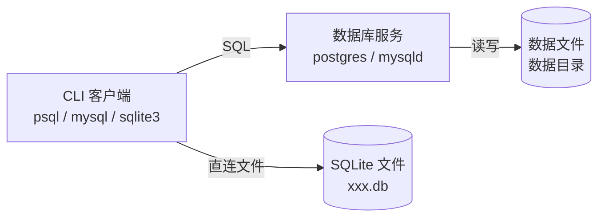

# 🗄️ SQLite入门 (Database Basics - SQLite)

很多时候你在 Linux 上排查问题、做数据处理、跑服务，都绕不开数据库：服务连不上、需要临时查一条数据、导入导出、备份恢复、迁移环境……

这篇写给**零基础/刚入门**：先让你"能跑起来、能查到数据、能看懂查询"，再慢慢上强度。

## 你将学到什么（先看这段就不慌）

- 10 分钟用 SQLite 建一个数据库文件，能插入/查询/导出 CSV
- 看懂并写出最常用的查询：WHERE / ORDER BY / LIMIT
- 第一次上手 Join（多表拼起来）与聚合（做统计报表）
- 了解索引/执行计划/事务是干什么的（不要求你马上用得很精）

## 学习路线（按顺序做）

1. **先做本节（SQLite）**：不需要安装服务，最快见到结果
2. **再做 SQL查询基础（SQL 组合）**：把查询写顺
3. **最后看 MySQL与PostgreSQL（MySQL/Postgres）**：把“会查”迁移到“会连”

---

## 0. 三句话建立全局观

1. **数据库 = 进程 + 数据文件 + 监听端口 + 权限**（不是"一个文件/一个网站"）。
2. **命令行最常用的是：连接、执行 SQL、导入导出、备份恢复、看状态**。
3. **先会 SQLite（单文件本地 DB），再会 MySQL/PostgreSQL（服务端 DB）**，学习成本最低。



### 0.1 术语表（小白版）

- **数据库（DB）**：装数据的"仓库"
- **表（Table）**：像 Excel 的一张表
- **行（Row）**：一条记录（例如一个用户）
- **列（Column）**：字段（例如 name、created_at）
- **主键（Primary Key）**：每行唯一的 id（最常见就是 id）
- **外键（Foreign Key）**：用 id 把两张表关联起来（例如 orders.user_id 指向 users.id）
- **客户端（Client）**：你敲命令用的工具（sqlite3 / mysql / psql）
- **服务端（Server）**：数据库进程本身（mysqld / postgres），它会监听端口

---

## 1. 我到底该用哪种数据库？

- **SQLite（推荐先学）**
  - 适合：本地脚本、临时分析、单机小工具、缓存/索引。
  - 特点：一个文件就是数据库；不需要启动服务；学习成本最低。
- **MySQL / MariaDB**
  - 适合：常见 Web 服务、业务系统、团队协作环境。
  - 特点：服务端监听端口；需要账号权限；生态广。
- **PostgreSQL（Postgres）**
  - 适合：对 SQL 标准/复杂查询/类型系统更强需求的项目。
  - 特点：功能强，命令行工具成熟（psql）。

---

## 2. SQLite：一个文件就是数据库

### 2.1 10 分钟快速上手

如果你只想马上"看到数据"，就按下面做：

1. 安装（如果你已能运行 `sqlite3`，跳过）
   - Ubuntu/Debian：
     ```bash
     sudo apt update && sudo apt install -y sqlite3
     ```
2. 新建一个练习目录并进入
   ```bash
   mkdir -p ~/db-demo && cd ~/db-demo
   ```
3. 创建数据库并进入交互
   ```bash
   sqlite3 demo.db
   ```
4. 复制粘贴下面这段 SQL（会建表并插入 2 行数据）
   ```sql
   CREATE TABLE IF NOT EXISTS users (
     id INTEGER PRIMARY KEY AUTOINCREMENT,
     name TEXT NOT NULL,
     created_at TEXT NOT NULL
   );

   INSERT INTO users(name, created_at) VALUES ('alice', datetime('now'));
   INSERT INTO users(name, created_at) VALUES ('bob', datetime('now'));
   ```
5. 打开"好看的输出模式"，然后查询
   ```sql
   .headers on
   .mode column
   SELECT * FROM users ORDER BY id;
   ```
6. 退出
   ```sql
   .quit
   ```

### 2.2 创建/打开数据库

```bash
sqlite3 demo.db
```

如果提示 `command not found: sqlite3`，说明未安装，回到上面第 2.0 的安装步骤。

进入交互后常用命令（前面有点 `.`）：

```sql
.help
.tables
.schema
.mode column
.headers on
.quit
```

新手常见"出不来"的情况：

- 输入写了一半想放弃：按 `Ctrl + C` 通常能取消当前输入，回到可继续输入的状态
- 想直接退出交互：除了 `.quit`，`Ctrl + D`（EOF）也是通用退出法

### 2.3 建表 + 插入 + 查询

```sql
CREATE TABLE IF NOT EXISTS users (
  id INTEGER PRIMARY KEY AUTOINCREMENT,
  name TEXT NOT NULL,
  created_at TEXT NOT NULL
);

INSERT INTO users(name, created_at) VALUES ('alice', datetime('now'));
INSERT INTO users(name, created_at) VALUES ('bob', datetime('now'));

SELECT * FROM users ORDER BY id DESC;
```

你看到的结果大概长这样（时间会不同）：

| id | name | created_at |
|---:|------|------------|
| 2 | bob | 2026-... |
| 1 | alice | 2026-... |

### 2.4 一次性执行 SQL（脚本化）

```bash
sqlite3 demo.db "SELECT count(*) FROM users;"
```

从文件执行：

```bash
sqlite3 demo.db < init.sql
```

### 2.5 导入/导出（CSV 最常用）

导出 CSV：

```bash
sqlite3 -header -csv demo.db "SELECT * FROM users;" > users.csv
```

导入 CSV（先建表再导入）：

```bash
sqlite3 demo.db
```

```sql
.mode csv
.import users.csv users
```

---

## 3. SQLite 数据类型与约束（实战必备）

### 3.1 SQLite 的五种存储类

SQLite 采用**动态类型系统**，比其他数据库更灵活：

| 存储类 | 说明 | 示例 |
|--------|------|------|
| `NULL` | 空值 | `NULL` |
| `INTEGER` | 有符号整数 | `42`, `-7` |
| `REAL` | 浮点数 | `3.14`, `-0.001` |
| `TEXT` | 文本字符串 | `'hello'`, `'中文'` |
| `BLOB` | 二进制数据 | 图片、文件等 |

**💡 重要区别**：SQLite 的 `INTEGER PRIMARY KEY` 会自动递增（类似 AUTOINCREMENT），但行为略有不同：

```sql
-- 方式1：自动递增（推荐）
id INTEGER PRIMARY KEY

-- 方式2：严格递增（性能稍差）
id INTEGER PRIMARY KEY AUTOINCREMENT
```

### 3.2 常用约束（防止脏数据）

```sql
CREATE TABLE products (
  id INTEGER PRIMARY KEY,
  name TEXT NOT NULL,              -- 不能为空
  price REAL CHECK(price > 0),     -- 价格必须大于0
  sku TEXT UNIQUE,                 -- 唯一约束
  category_id INTEGER REFERENCES categories(id)  -- 外键
);
```

**启用外键检查**（SQLite 默认关闭）：

```sql
PRAGMA foreign_keys = ON;
```

---

## 4. SQLite 最佳实践与性能优化

### 4.1 什么时候用 SQLite？

**✅ 适合场景**：
- 本地应用/移动端（微信聊天记录、游戏存档）
- 原型开发/测试环境
- 单机小工具/脚本
- 嵌入式设备（IoT）
- 数据量 < 10GB

**❌ 不适合场景**：
- 高并发写入（>100 并发写）
- 多用户 Web 应用
- 需要细粒度权限控制
- 大数据量分析（>100GB）

**💡 来自稀土掘金的对比总结**：
> SQLite 的竞争对手不是 client/server 数据库，而是本地文件存储 `fopen()`。当你需要一个结构化的、可查询的文件存储时，选 SQLite。

### 4.2 性能优化技巧

**1. 使用事务批量插入**（性能提升 10-100 倍）：

```sql
-- ❌ 慢：每条插入一个事务
INSERT INTO users(name) VALUES ('alice');
INSERT INTO users(name) VALUES ('bob');

-- ✅ 快：批量提交
BEGIN;
INSERT INTO users(name) VALUES ('alice');
INSERT INTO users(name) VALUES ('bob');
INSERT INTO users(name) VALUES ('cathy');
COMMIT;
```

**2. 创建索引加速查询**：

```sql
-- 为常用查询条件创建索引
CREATE INDEX idx_users_name ON users(name);
CREATE INDEX idx_orders_created_at ON orders(created_at);
```

**3. 使用 EXPLAIN QUERY PLAN 查看执行计划**：

```sql
EXPLAIN QUERY PLAN
SELECT * FROM users WHERE name = 'alice';
```

**4. 定期 VACUUM 回收空间**：

```bash
sqlite3 demo.db "VACUUM;"
```

### 4.3 SQLite vs MySQL vs PostgreSQL 选型指南

| 特性 | SQLite | MySQL | PostgreSQL |
|------|--------|-------|------------|
| 架构 | 无服务器，单文件 | 客户端/服务器 | 客户端/服务器 |
| 并发 | 单写多读 | 高并发 | 高并发 |
| 适用场景 | 本地/嵌入式 | Web应用 | 复杂查询/数据分析 |
| 配置 | 零配置 | 需要配置 | 需要配置 |
| SQL标准 | 部分支持 | 部分支持 | 完全支持 |
| JSON支持 | 有限 | 支持 | 强大 |

**💡 选型决策树**：
```
需要多用户并发？
├─ 是 → 需要复杂查询/JSON？
│      ├─ 是 → PostgreSQL
│      └─ 否 → MySQL
└─ 否 → SQLite
```

---

## 5. SQLite 实用工具与技巧

### 5.1 常用 PRAGMA 命令

```sql
-- 查看表信息
PRAGMA table_info(users);

-- 查看索引
PRAGMA index_list(users);

-- 检查数据库完整性
PRAGMA integrity_check;

-- 查看 SQLite 版本
SELECT sqlite_version();
```

### 5.2 SQLite 日期时间函数

```sql
-- 当前时间
SELECT datetime('now');
SELECT date('now');

-- 格式化
SELECT strftime('%Y-%m-%d %H:%M:%S', 'now');

-- 日期计算
SELECT date('now', '+1 day');
SELECT date('now', '-1 month');
```

### 5.3 SQLite 命令行技巧

```bash
# 一行命令执行查询
sqlite3 demo.db "SELECT count(*) FROM users;"

# 导入 SQL 文件
sqlite3 demo.db < init.sql

# 导出整个数据库为 SQL
sqlite3 demo.db ".dump" > backup.sql

# 带格式输出
sqlite3 -header -column demo.db "SELECT * FROM users;"

# 查看数据库大小
ls -lh demo.db
```

---

## 6. 练习题（附答案）

### 练习 1：创建博客数据库

创建一个博客系统的基础表结构，包括 `posts`（文章）和 `comments`（评论）表。

<details>
<summary>点击查看答案</summary>

```sql
CREATE TABLE posts (
  id INTEGER PRIMARY KEY,
  title TEXT NOT NULL,
  content TEXT,
  created_at TEXT DEFAULT datetime('now')
);

CREATE TABLE comments (
  id INTEGER PRIMARY KEY,
  post_id INTEGER NOT NULL,
  author TEXT NOT NULL,
  content TEXT NOT NULL,
  created_at TEXT DEFAULT datetime('now'),
  FOREIGN KEY (post_id) REFERENCES posts(id)
);
```
</details>

### 练习 2：批量插入数据

使用事务插入 5 篇文章和 10 条评论。

<details>
<summary>点击查看答案</summary>

```sql
BEGIN;

INSERT INTO posts(title, content) VALUES
  ('SQLite 入门', '这是一篇关于 SQLite 的教程'),
  ('SQL 优化', '如何优化 SQL 查询性能'),
  ('数据库选型', 'SQLite vs MySQL vs PostgreSQL'),
  ('事务管理', '理解数据库事务'),
  ('索引原理', '数据库索引是如何工作的');

INSERT INTO comments(post_id, author, content) VALUES
  (1, 'alice', '写得很好！'),
  (1, 'bob', '学到了'),
  (2, 'cathy', '实用'),
  (2, 'alice', '收藏了'),
  (3, 'bob', '对比很清晰'),
  (3, 'cathy', ' helpful'),
  (4, 'alice', '事务很重要'),
  (4, 'bob', '明白了'),
  (5, 'cathy', '索引是关键'),
  (5, 'alice', '谢谢分享');

COMMIT;
```
</details>

### 练习 3：查询统计

查询每篇文章的评论数量，按评论数降序排列。

<details>
<summary>点击查看答案</summary>

```sql
SELECT 
  p.title,
  COUNT(c.id) AS comment_count
FROM posts p
LEFT JOIN comments c ON c.post_id = p.id
GROUP BY p.id, p.title
ORDER BY comment_count DESC;
```
</details>

---

## 参考资料

- 📚 [菜鸟教程 - SQLite 教程](https://www.runoob.com/sqlite/sqlite-tutorial.html)
- 📚 [SQLite 官方文档](https://www.sqlite.org/docs.html)
- 💡 [稀土掘金 - SQLite vs MySQL vs PostgreSQL 对比](https://juejin.cn/post/7381820436272709642)
- 💡 [Android 官方 - SQLite 性能最佳实践](https://developer.android.com/topic/performance/sqlite-performance-best-practices)
- 🎓 [廖雪峰 - SQLite 教程](https://liaoxuefeng.com/books/python/database/sqlite/index.html)
- 🎓 [知乎 - 一小时实践入门 SQLite](https://zhuanlan.zhihu.com/p/643923428)
