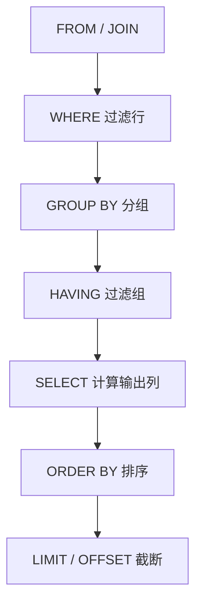

# 🔍 SQL查询基础 (Database - SQL Query Basics)

---

## 1. SQL 语法骨架（把查询写顺手）

### 1.1 SELECT 的"标准骨架"

```sql
SELECT
  列, 表达式 AS 别名
FROM 表
JOIN 其它表 ON 连接条件
WHERE 行过滤条件
GROUP BY 分组列
HAVING 分组过滤条件
ORDER BY 排序列
LIMIT 10 OFFSET 20;
```

### 1.2 真正的执行顺序（很多人写不对就是因为这个）



### 1.3 字符串/数字/日期与引号（最常见语法）

- **字符串要用单引号**：`'paid'`、`'alice'`
- **数字不要加引号**：`qty >= 2`
- **日期/时间在多数数据库里也用字符串表示**（具体类型各库不同），先按最朴素写法用：`created_at >= '2026-02-01'`
- **标识符（表名/列名）一般不需要引号**，但如果你用了保留字或奇怪字符，才考虑用双引号/反引号（不同数据库规则不同）

```sql
SELECT * FROM orders WHERE status = 'paid';
SELECT * FROM order_items WHERE qty >= 2;
SELECT * FROM orders WHERE created_at >= '2026-02-01';
```

### 1.4 WHERE 条件怎么写（小白最常卡住的地方）

#### 比较运算

```sql
-- 等于 / 不等于
SELECT * FROM orders WHERE status = 'paid';
SELECT * FROM orders WHERE status != 'refund';

-- 大于/小于（数字或日期字符串）
SELECT * FROM products WHERE price >= 100;
SELECT * FROM orders WHERE created_at < '2026-02-03';
```

#### 逻辑组合（AND / OR + 括号）

```sql
-- AND：同时满足
SELECT * FROM orders WHERE status = 'paid' AND user_id = 1;

-- OR：满足其一（注意括号）
SELECT *
FROM orders
WHERE (status = 'paid' OR status = 'refund')
  AND user_id = 1;
```

#### 集合与范围（IN / BETWEEN）

```sql
SELECT * FROM orders WHERE status IN ('paid', 'refund');
SELECT * FROM products WHERE price BETWEEN 100 AND 500;
```

#### 模糊匹配（LIKE）

```sql
-- % 代表任意长度字符
SELECT * FROM products WHERE name LIKE '%mouse%';
```

#### NULL 判断（必须用 IS）

```sql
SELECT * FROM users WHERE city IS NULL;
SELECT * FROM users WHERE city IS NOT NULL;
```

### 1.5 排序与分页（ORDER BY / LIMIT）

```sql
-- 默认升序 ASC
SELECT * FROM users ORDER BY id ASC;

-- 降序 DESC（最常用：取"最新/最大"）
SELECT * FROM orders ORDER BY created_at DESC LIMIT 10;

-- 第 3 页（每页 10 条）：OFFSET = (页码-1) * size
SELECT * FROM orders ORDER BY created_at DESC LIMIT 10 OFFSET 20;
```

### 1.6 必会的"坑点语法"（少踩坑）

- **NULL 不是空字符串**：`= NULL` 永远不成立，要用 `IS NULL / IS NOT NULL`
- **COALESCE**：给 NULL 兜底

```sql
SELECT id, name, COALESCE(city, 'unknown') AS city FROM users;
```

- **CASE WHEN**：SQL 里的 if/else

```sql
SELECT
  id,
  price,
  CASE
    WHEN price >= 1000 THEN 'high'
    WHEN price >= 200 THEN 'mid'
    ELSE 'new'
  END AS tier
FROM products;
```

- **分页**：
  - SQLite/Postgres：`LIMIT ... OFFSET ...`
  - MySQL：`LIMIT offset, size` 或 `LIMIT size OFFSET offset`

---

## 2. 数据类型 / 编码 / 时区避坑（新手最容易栽）

### 2.1 VARCHAR vs TEXT：怎么选才不纠结

- **VARCHAR**：长度可控，适合"有上限"的字段（用户名、标题、邮箱）
- **TEXT**：适合"可能很长"的字段（正文、长描述、富文本）
- 实用建议：能明确上限就用 VARCHAR；不确定、可能很长再用 TEXT；别为了省事所有都用 TEXT

### 2.2 DATETIME 与时区：为什么会"晚 8 小时"

新手最常见困惑：日志显示 `10:00`，数据库里却是 `18:00`（或反过来），通常是 **时区没对齐**。

- **DATETIME（无时区）**：它只是一串"年月日时分秒"，不自带时区信息
- **TIMESTAMP / timestamptz（带时区语义）**：不同数据库行为不同，但总体更适合跨时区系统
- 推荐做法（最稳）：**统一用 UTC 存储，展示时再转成本地时区**

快速自检（MySQL）：

```sql
SELECT NOW() AS now_local, UTC_TIMESTAMP() AS now_utc;
SHOW VARIABLES LIKE '%time_zone%';
```

快速自检（Postgres）：

```sql
SHOW TIME ZONE;
SELECT now() AS now_local, now() AT TIME ZONE 'UTC' AS now_utc;
```

### 2.3 字符集/编码：中文乱码高频提醒

一句话原则：**确保你的终端与数据库连接都使用 UTF-8**。

- MySQL 自检：
  - `SHOW VARIABLES LIKE 'character_set%';`
  - `SHOW VARIABLES LIKE 'collation%';`（常见推荐 `utf8mb4`）
- Postgres 自检：
  - `SHOW server_encoding;`
  - `SHOW client_encoding;`（psql 里也可以用 `\\encoding`）

---

## 3. 一套可复用的练习数据（后面复杂查询都用它）

这一套表足够覆盖 90% 面试/业务 SQL 组合：用户、订单、订单明细、商品。

### 3.1 建表（SQLite 也能跑；MySQL/Postgres 小改即可）

```sql
CREATE TABLE IF NOT EXISTS users (
  id INTEGER PRIMARY KEY,
  name TEXT NOT NULL,
  city TEXT,
  created_at TEXT NOT NULL
);

CREATE TABLE IF NOT EXISTS products (
  id INTEGER PRIMARY KEY,
  name TEXT NOT NULL,
  price REAL NOT NULL
);

CREATE TABLE IF NOT EXISTS orders (
  id INTEGER PRIMARY KEY,
  user_id INTEGER NOT NULL,
  status TEXT NOT NULL,
  created_at TEXT NOT NULL
);

CREATE TABLE IF NOT EXISTS order_items (
  id INTEGER PRIMARY KEY,
  order_id INTEGER NOT NULL,
  product_id INTEGER NOT NULL,
  qty INTEGER NOT NULL
);
```

### 3.2 填充一点数据

```sql
DELETE FROM order_items;
DELETE FROM orders;
DELETE FROM products;
DELETE FROM users;

INSERT INTO users(id, name, city, created_at) VALUES
  (1, 'alice', 'shanghai', '2026-01-01'),
  (2, 'bob', 'beijing',  '2026-01-10'),
  (3, 'cathy', NULL,     '2026-01-15');

INSERT INTO products(id, name, price) VALUES
  (1, 'keyboard', 299),
  (2, 'mouse', 99),
  (3, 'monitor', 1299);

INSERT INTO orders(id, user_id, status, created_at) VALUES
  (101, 1, 'paid',   '2026-02-01'),
  (102, 1, 'refund', '2026-02-03'),
  (103, 2, 'paid',   '2026-02-05');

INSERT INTO order_items(id, order_id, product_id, qty) VALUES
  (1, 101, 1, 1),
  (2, 101, 2, 2),
  (3, 102, 3, 1),
  (4, 103, 2, 1);
```

### 3.3 一键初始化（SQLite）

你可以直接用下面这段命令生成 `init.sql`（里面已经包含第 3.1 + 3.2 的全部 SQL）：

```bash
cat > init.sql <<'SQL'
CREATE TABLE IF NOT EXISTS users (
  id INTEGER PRIMARY KEY,
  name TEXT NOT NULL,
  city TEXT,
  created_at TEXT NOT NULL
);

CREATE TABLE IF NOT EXISTS products (
  id INTEGER PRIMARY KEY,
  name TEXT NOT NULL,
  price REAL NOT NULL
);

CREATE TABLE IF NOT EXISTS orders (
  id INTEGER PRIMARY KEY,
  user_id INTEGER NOT NULL,
  status TEXT NOT NULL,
  created_at TEXT NOT NULL
);

CREATE TABLE IF NOT EXISTS order_items (
  id INTEGER PRIMARY KEY,
  order_id INTEGER NOT NULL,
  product_id INTEGER NOT NULL,
  qty INTEGER NOT NULL
);

DELETE FROM order_items;
DELETE FROM orders;
DELETE FROM products;
DELETE FROM users;

INSERT INTO users(id, name, city, created_at) VALUES
  (1, 'alice', 'shanghai', '2026-01-01'),
  (2, 'bob', 'beijing',  '2026-01-10'),
  (3, 'cathy', NULL,     '2026-01-15');

INSERT INTO products(id, name, price) VALUES
  (1, 'keyboard', 299),
  (2, 'mouse', 99),
  (3, 'monitor', 1299);

INSERT INTO orders(id, user_id, status, created_at) VALUES
  (101, 1, 'paid',   '2026-02-01'),
  (102, 1, 'refund', '2026-02-03'),
  (103, 2, 'paid',   '2026-02-05');

INSERT INTO order_items(id, order_id, product_id, qty) VALUES
  (1, 101, 1, 1),
  (2, 101, 2, 2),
  (3, 102, 3, 1),
  (4, 103, 2, 1);
SQL
```

然后执行：

```bash
sqlite3 demo.db < init.sql
```

如果你不习惯上面的写法，也可以用编辑器直接新建 `init.sql`（比如 `nano init.sql`），把 SQL 粘贴进去保存即可。

---

## 4. SQL JOIN 详解（图解+实战）

### 4.1 JOIN 类型一览

**💡 来自菜鸟教程的 JOIN 图解**：

| JOIN 类型 | 说明 | 图示 |
|-----------|------|------|
| `INNER JOIN` | 只返回两个表中匹配的行 | A ∩ B（交集） |
| `LEFT JOIN` | 返回左表所有行 + 右表匹配行 | A + (A ∩ B) |
| `RIGHT JOIN` | 返回右表所有行 + 左表匹配行 | B + (A ∩ B) |
| `FULL OUTER JOIN` | 返回两个表的所有行 | A ∪ B（并集） |
| `CROSS JOIN` | 笛卡尔积（所有组合） | A × B |
| `SELF JOIN` | 表与自身连接 | - |

### 4.2 INNER JOIN（最常用）

```sql
-- 查询每个订单的用户信息
SELECT 
  o.id AS order_id,
  u.name AS user_name,
  o.status,
  o.created_at
FROM orders o
INNER JOIN users u ON o.user_id = u.id;
```

**执行过程**：
1. 从 `orders` 表取一行
2. 在 `users` 表中查找匹配的 `user_id`
3. 如果找到，合并为一行输出
4. 重复直到所有行处理完

### 4.3 LEFT JOIN（保留左表）

```sql
-- 查询所有用户及其订单（包括没有订单的用户）
SELECT 
  u.id,
  u.name,
  o.id AS order_id,
  o.status
FROM users u
LEFT JOIN orders o ON u.id = o.user_id;
```

**结果**：
- alice：有订单 → 显示订单信息
- bob：有订单 → 显示订单信息
- cathy：没有订单 → `order_id` 和 `status` 为 `NULL`

**实战场景**：
- 找出没有订单的用户：
```sql
SELECT u.*
FROM users u
LEFT JOIN orders o ON u.id = o.user_id
WHERE o.id IS NULL;  -- 关键：右表字段为 NULL
```

### 4.4 多表 JOIN

```sql
-- 查询订单详情：用户 + 订单 + 商品
SELECT 
  u.name AS user_name,
  o.id AS order_id,
  p.name AS product_name,
  oi.qty,
  p.price,
  oi.qty * p.price AS subtotal
FROM orders o
JOIN users u ON u.id = o.user_id
JOIN order_items oi ON oi.order_id = o.id
JOIN products p ON p.id = oi.product_id
ORDER BY o.id;
```

**💡 JOIN 顺序很重要**：
- 先用小表 JOIN 大表（性能更好）
- 确保 JOIN 条件有索引

### 4.5 JOIN 实战技巧

**1. 使用表别名简化**：
```sql
-- ❌ 冗长
SELECT orders.id, users.name FROM orders JOIN users ON orders.user_id = users.id;

-- ✅ 简洁
SELECT o.id, u.name FROM orders o JOIN users u ON o.user_id = u.id;
```

**2. USING 子句（当列名相同时）**：
```sql
-- 等价写法
SELECT * FROM orders o JOIN users u ON o.user_id = u.id;
SELECT * FROM orders o JOIN users u USING (user_id);  -- 仅限列名相同
```

**3. 避免 SELECT ***：
```sql
-- ❌ 不必要的数据传输
SELECT * FROM orders o JOIN users u ON o.user_id = u.id;

-- ✅ 只选择需要的列
SELECT o.id, o.status, u.name FROM orders o JOIN users u ON o.user_id = u.id;
```

---

## 5. WHERE 条件高级技巧

### 5.1 性能优化：让索引生效

```sql
-- ❌ 索引失效（对索引列使用函数）
SELECT * FROM orders WHERE YEAR(created_at) = 2026;

-- ✅ 索引有效
SELECT * FROM orders WHERE created_at >= '2026-01-01' AND created_at < '2027-01-01';

-- ❌ 索引失效（隐式类型转换）
SELECT * FROM users WHERE id = '1';  -- id 是 INTEGER

-- ✅ 索引有效
SELECT * FROM users WHERE id = 1;
```

### 5.2 IN vs EXISTS

```sql
-- IN：适合小列表
SELECT * FROM products WHERE id IN (1, 2, 3);

-- EXISTS：适合子查询
SELECT * FROM users u
WHERE EXISTS (
  SELECT 1 FROM orders o WHERE o.user_id = u.id AND o.status = 'paid'
);
```

**性能对比**：
- `IN`：适合静态列表（< 100 个值）
- `EXISTS`：适合子查询，遇到第一个匹配就停止

### 5.3 LIKE 模糊匹配优化

```sql
-- ❌ 慢：前缀通配符（索引失效）
SELECT * FROM products WHERE name LIKE '%phone%';

-- ✅ 快：前缀匹配（索引有效）
SELECT * FROM products WHERE name LIKE 'phone%';

-- ✅ 全文搜索（大数据量）
-- MySQL: MATCH ... AGAINST
-- PostgreSQL: to_tsvector
```

---

## 6. GROUP BY 与聚合函数深度讲解

### 6.1 聚合函数一览

| 函数 | 说明 | 示例 |
|------|------|------|
| `COUNT()` | 计数 | `COUNT(*)`, `COUNT(name)` |
| `SUM()` | 求和 | `SUM(price)` |
| `AVG()` | 平均值 | `AVG(price)` |
| `MAX()` | 最大值 | `MAX(price)` |
| `MIN()` | 最小值 | `MIN(price)` |

### 6.2 GROUP BY 执行过程


### 6.3 实战案例

**1. 基础聚合**：

```sql
-- 每个用户的订单数
SELECT 
  u.name,
  COUNT(o.id) AS order_count
FROM users u
LEFT JOIN orders o ON u.id = o.user_id
GROUP BY u.id, u.name;
```

**2. 多列分组**：

```sql
-- 每个城市每月的订单数
SELECT 
  u.city,
  strftime('%Y-%m', o.created_at) AS month,
  COUNT(*) AS order_count,
  SUM(oi.qty * p.price) AS revenue
FROM orders o
JOIN users u ON u.id = o.user_id
JOIN order_items oi ON oi.order_id = o.id
JOIN products p ON p.id = oi.product_id
GROUP BY u.city, month
ORDER BY revenue DESC;
```

**3. HAVING 过滤**：

```sql
-- 找出消费超过 500 的用户
SELECT 
  u.name,
  SUM(oi.qty * p.price) AS total_spent
FROM users u
JOIN orders o ON u.id = o.user_id
JOIN order_items oi ON oi.order_id = o.id
JOIN products p ON p.id = oi.product_id
GROUP BY u.id, u.name
HAVING total_spent > 500;
```

**💡 WHERE vs HAVING**：
- `WHERE`：在分组前过滤**行**
- `HAVING`：在分组后过滤**组**

### 6.4 常见错误

```sql
-- ❌ 错误：SELECT 中的非聚合列必须在 GROUP BY 中
SELECT name, city, COUNT(*) FROM users GROUP BY city;

-- ✅ 正确
SELECT city, COUNT(*) FROM users GROUP BY city;

-- ❌ 错误：在 WHERE 中使用聚合函数
SELECT * FROM orders WHERE COUNT(*) > 5;

-- ✅ 正确：使用 HAVING
SELECT user_id, COUNT(*) FROM orders GROUP BY user_id HAVING COUNT(*) > 5;
```

---

## 7. 子查询与 CTE（WITH）

### 7.1 子查询类型

**1. 标量子查询**（返回单个值）：

```sql
-- 查询消费高于平均值的用户
SELECT name
FROM users
WHERE id IN (
  SELECT user_id 
  FROM orders 
  GROUP BY user_id 
  HAVING SUM(amount) > (SELECT AVG(total) FROM user_totals)
);
```

**2. 行子查询**（返回一行）：

```sql
-- 查询与 alice 同城市的用户
SELECT * FROM users 
WHERE city = (SELECT city FROM users WHERE name = 'alice');
```

**3. 表子查询**（返回多行多列）：

```sql
-- 查询有订单的用户
SELECT * FROM users
WHERE id IN (SELECT DISTINCT user_id FROM orders);
```

### 7.2 CTE（Common Table Expression）

**💡 为什么用 CTE？**
- 更易读：把复杂查询拆成多步
- 可重用：CTE 可以多次引用
- 易调试：可以单独测试每个 CTE

```sql
-- 计算每个用户的消费排名
WITH user_totals AS (
  -- 第一步：计算每个用户的总消费
  SELECT 
    u.id,
    u.name,
    SUM(oi.qty * p.price) AS total_spent
  FROM users u
  JOIN orders o ON u.id = o.user_id
  JOIN order_items oi ON oi.order_id = o.id
  JOIN products p ON p.id = oi.product_id
  GROUP BY u.id, u.name
),
ranked_users AS (
  -- 第二步：排名
  SELECT 
    *,
    RANK() OVER (ORDER BY total_spent DESC) AS rank
  FROM user_totals
)
-- 第三步：查询结果
SELECT * FROM ranked_users WHERE rank <= 10;
```

---

## 8. LeetCode 风格练习题（附答案）

### 练习 1：第二高的薪水（LeetCode 176）

找出薪水第二高的员工。

<details>
<summary>点击查看答案</summary>

```sql
-- 方法1：子查询
SELECT MAX(salary) AS SecondHighestSalary
FROM employees
WHERE salary < (SELECT MAX(salary) FROM employees);

-- 方法2：LIMIT/OFFSET
SELECT DISTINCT salary AS SecondHighestSalary
FROM employees
ORDER BY salary DESC
LIMIT 1 OFFSET 1;
```
</details>

### 练习 2：从不订购的客户（LeetCode 183）

找出从未下过订单的客户。

<details>
<summary>点击查看答案</summary>

```sql
-- 方法1：LEFT JOIN
SELECT c.name AS Customers
FROM customers c
LEFT JOIN orders o ON c.id = o.customer_id
WHERE o.id IS NULL;

-- 方法2：NOT EXISTS
SELECT name AS Customers
FROM customers c
WHERE NOT EXISTS (
  SELECT 1 FROM orders o WHERE o.customer_id = c.id
);

-- 方法3：NOT IN
SELECT name AS Customers
FROM customers
WHERE id NOT IN (SELECT customer_id FROM orders);
```
</details>

### 练习 3：部门最高工资（LeetCode 184）

找出每个部门工资最高的员工。

<details>
<summary>点击查看答案</summary>

```sql
SELECT d.name AS Department, e.name AS Employee, e.salary
FROM employees e
JOIN departments d ON e.department_id = d.id
WHERE (e.department_id, e.salary) IN (
  SELECT department_id, MAX(salary)
  FROM employees
  GROUP BY department_id
);
```
</details>

### 练习 4：连续出现的数字（LeetCode 180）

找出至少连续出现 3 次的数字。

<details>
<summary>点击查看答案</summary>

```sql
SELECT DISTINCT l1.num AS ConsecutiveNums
FROM logs l1
JOIN logs l2 ON l1.id = l2.id - 1
JOIN logs l3 ON l1.id = l3.id - 2
WHERE l1.num = l2.num AND l2.num = l3.num;
```
</details>

### 练习 5：超过经理收入的员工

找出收入高于其经理的员工。

<details>
<summary>点击查看答案</summary>

```sql
SELECT e1.name AS Employee
FROM employees e1
JOIN employees e2 ON e1.manager_id = e2.id
WHERE e1.salary > e2.salary;
```
</details>

---

## 参考资料

- 📚 [菜鸟教程 - SQL JOIN](https://www.runoob.com/sql/sql-join.html)
- 💡 [知乎 - 图解SQL JOINS，小白必看](https://zhuanlan.zhihu.com/p/2511800292)
- 💡 [ExplainThis - 一张图搞懂SQL JOIN](https://www.explainthis.io/zh-hans/swe/sql-join)
- 🎓 [LeetCode SQL 题库](https://leetcode.cn/problemset/database/)
- 🎓 [SQLZoo 在线练习](https://sqlzoo.net/)
